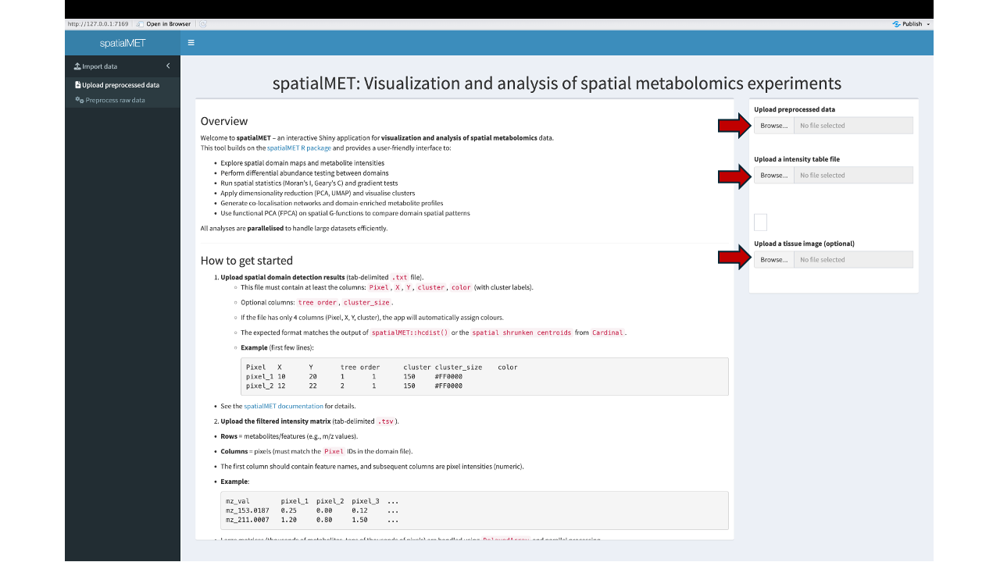
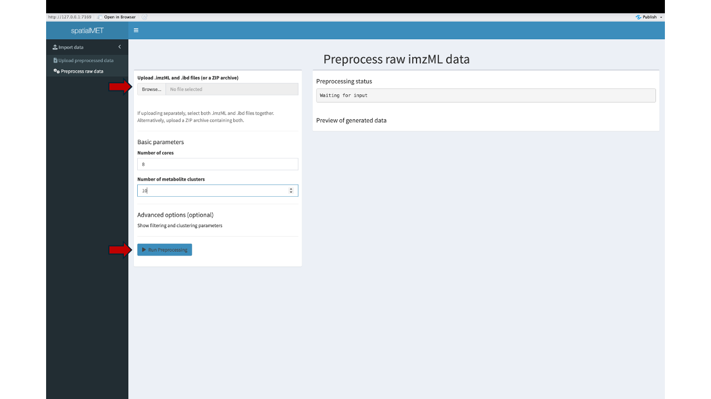
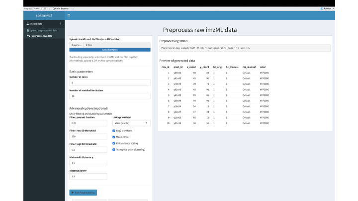
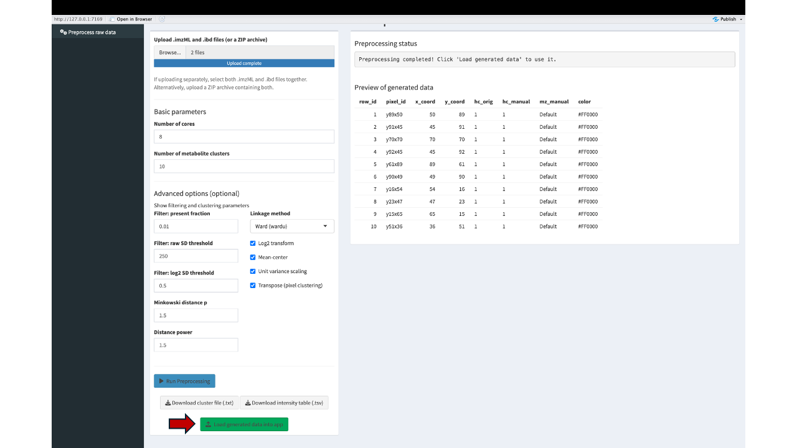
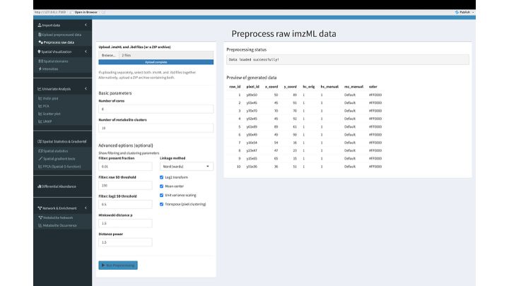

# spatialMET

A comprehensive pipeline for domain detection and annotation of spatial metabolomics data using hierarchical clustering with Shiny app integration for interactive exploration.

---

## Quick Start: Using the Pre‑built Docker Image

The spatialMET Shiny application is available as a pre‑built Docker container on Docker Hub.  
To run it:

1. Ensure Docker Desktop is installed on your computer.
2. Launch the application with:

```bash
docker run --rm -p 3838:3838 yonatan2627/spatialmet_app:latest
```

3. Open your browser and go to: [http://localhost:3838](http://localhost:3838)

---

## Building the spatialMET Shiny App from Source

If you prefer to build the container yourself or customise the code:

### 1. Clone the repository

```bash
git clone https://github.com/biodatalab/spatialMET.git
cd spatialMET
```

### 2. Build the Docker image

```bash
docker build --no-cache -t spatialmet_app .
```

### 3. Run your local build

```bash
docker run --rm -p 3838:3838 spatialmet_app
```

Access the app at [http://localhost:3838](http://localhost:3838).

---

### (Optional) Push Your Own Image to Docker Hub

If you want to share your built image (or use it on multiple machines), you can push it to Docker Hub:

```bash
# Tag with your Docker Hub username and repository name
docker tag spatialmet_app your-username/spatialmet_app:latest

# Log in to Docker Hub
docker login

# Push the image
docker push your-username/spatialmet_app:latest
```

Now anyone can run your image with:

```bash
docker run --rm -p 3838:3838 your-username/spatialmet_app:latest
```

### For advanced users

The repository also provides a standalone script, `run_pipeline.sh`, which executes
the full preprocessing pipeline outside the Shiny application.
This is particularly useful for high‑performance computing (HPC) environments,
batch processing of multiple samples, or handling very large datasets (GB in size)
that may exceed the memory limits of a Docker container. The script uses the same underlying
`hcdist` C algorithm and filtering steps as the app, ensuring consistent results across both interfaces.
The outputs generated by this script can be directly uploaded into the Shiny app for 
downstream analysis, providing a seamless workflow from data processing to interactive exploration.

## Dependencies

For **local (non‑Docker) installation**, the `dependencies.txt` file lists all required R packages, including both CRAN and Bioconductor dependencies.  
If you are running the Shiny app directly from R (outside the Docker container), you must install these packages before launching the app.

---

## The spatialMET Pipeline: A Three-Step Workflow

### 1. Data Input and Preprocessing

Raw mass spectrometry imaging files are processed using [Cardinal](https://www.bioconductor.org/packages/release/bioc/html/Cardinal.html), a Bioconductor package for mass spectrometry imaging analysis. This preprocessing step converts instrument-generated files (e.g., `.ibd` and `.imzML` formats from MALDI-MSI) into structured text files containing pixel coordinates and peak intensities for each spatial location.

The resulting data formats include:

- **Intensity matrices** (peak intensities across pixels)
- **hcdist matrices** (pre-processed distance matrices for hierarchical clustering)

These formatted datasets are required inputs for the spatialMET application.

---

#### Uploading Pre-processed Data

If you already have generated the required cluster and intensity files, you can upload them directly through the **"Upload preprocessed data"** tab. The red arrows in Figure 1 indicate where to upload the cluster file (first arrow),  the intensity file (second arrow), and optionally the H$E image (third arrow).



**Figure 1:** The file upload interface for pre-processed cluster and intensity data. Red arrows indicate the file input fields for uploading the two required data files.

---

#### Preprocessing Raw Data

If you have raw `.ibd` and `.imzML` files, you can upload them through the **"Preprocess raw data"** tab as shown in Figure 2.



**Figure 2:** The raw data preprocessing interface showing where to upload `.ibd` and `.imzML` files. The first red arrow indicates the file upload field, and the second red arrow shows the "Run Preprocessing" button that initiates the pipeline.

Once the upload is complete, you can initiate the preprocessing pipeline by clicking the **"Run Preprocessing"** button. The pipeline will process your raw data through the following stages:

1. **Cardinal extraction** – reads the `.imzML`/`.ibd` files and extracts peak intensities
2. **Data filtering** – removes low-intensity noise and filters features based on statistical thresholds
3. **Feature clustering** – builds a hierarchical tree of metabolites based on spatial co-expression patterns
4. **Pixel clustering** – detects spatial domains by clustering pixels with similar molecular profiles

---

#### Successful Preprocessing

Upon successful completion of the preprocessing pipeline, a preview of the generated data will appear as shown in Figure 3. At this stage, the data is ready for downstream analysis.



**Figure 3:** The preprocessing completion interface showing the status message, data preview table, and action buttons. The data is now ready for download or direct loading into the app.

From this interface, you can:

- **Download the cluster file** (`.txt`) – contains pixel coordinates and cluster assignments
- **Download the intensity table** (`.tsv`) – contains metabolite intensities for each pixel
- **Load generated data into app** – directly imports the data into the Shiny app for downstream analysis (red arrow in Figure 4)

---

#### Loading Data into the App

Once preprocessing is complete, click the **"Load generated data into app"** button (red arrow in Figure 4) to import the data directly into the Shiny app for downstream analysis.



**Figure 4:** The interface after successful preprocessing showing the "Load generated data into app" button (red arrow). Clicking this button imports the data directly into the app without requiring manual download and upload.

---

#### Downstream Analysis Interface

After the data is loaded, the sidebar analysis menu appears on the left side of the app, providing access to all analysis modules as shown in Figure 5.



**Figure 5:** The spatialMET Shiny app interface showing the expanded sidebar with all analysis modules available after data loading. This highlights the expanded menu with access to Spatial Visualization, Univariate Analysis, Spatial Statistics & Gradients, Differential Abundance, and Network & Enrichment tools.

---

### 2. Spatial Domain Detection

Spatial domains are detected using hierarchical clustering implemented through a computationally-efficient C algorithm named **hcdist**. This algorithm rapidly processes spatial metabolomics data to identify coherent tissue regions based on molecular expression patterns.

The hcdist algorithm offers:

- **Computational efficiency** – optimized for large MSI datasets with thousands of pixels
- **Scalable performance** – maintains speed with increasing pixel counts
- **Optimal memory management** – handles large matrices through efficient data structures

---

### 3. Exploratory Data Analysis and Interactive Visualization

The spatialMET Shiny application provides comprehensive tools for downstream analysis and interactive exploration:

#### Spatial Visualization

The app provides interactive visualization of spatial domains and individual metabolite intensities. Users can:

- **Visualize spatial domains** – view detected tissue regions with customizable color palettes
- **Visualize metabolite intensities** – display spatial distribution of any detected metabolite
- **Annotate regions of interest** – manually select and label specific tissue regions
- **Overlay reference images** – superimpose tissue images for anatomical context

---

#### Statistical Analyses

The app includes several statistical modules for downstream analysis:

- **Differential Abundance Testing** – identifies significant molecular differences between spatial domains using multiple statistical methods (Wilcoxon, T-test, Hellinger distance, and spatial limma)

- **Spatial Statistics** – calculates Moran's I and Geary's C to detect spatial autocorrelation and identify expression "hotspots"

- **Spatial Gradient Testing** – detects metabolites that show systematic spatial gradients away from reference domains

- **FPCA (Functional PCA)** – performs functional principal component analysis on spatial G-functions to compare spatial patterns across domains

---

#### Univariate Analysis

The univariate analysis module provides tools for exploring individual metabolite patterns:

- **Violin plots** – compare intensity distributions across domains
- **Principal Component Analysis (PCA)** – visualize global data structure and domain separation
- **Scatter plots** – explore relationships between pairs of metabolites
- **UMAP** – non-linear dimensionality reduction for visualizing data structure

---

#### Network & Enrichment Analysis

- **Metabolite Network** – builds correlation networks to identify co-expressed metabolite modules
- **Metabolite Occurrence** – identifies domain-enriched metabolites through statistical testing

---

## Troubleshooting Common Issues

### Platform Mismatch (Apple Silicon M1/M2/M3)

If you are on an **Apple Silicon** Mac (M1, M2, M3), the pre‑compiled `hcdist` binary may be incompatible with the ARM architecture.  
To avoid “Illegal instruction” or “cannot execute binary file” errors, **build and run the image for the AMD64 platform** (x86_64 emulation):

```bash
docker build --platform linux/amd64 --no-cache -t spatialmet_app .
docker run --platform linux/amd64 --rm -p 3838:3838 spatialmet_app
```

This uses Rosetta 2 / QEMU emulation and ensures the binary runs correctly.

---

### “Permission denied” or “cannot execute binary file” errors

- Ensure the `hcdist` and `maldi_image_from_clusters` binaries are executable inside the container.  
  The Dockerfile already runs `chmod +x` on these files, but if you copied them manually, run:

```bash
chmod +x hcdist_stage1/hcdist/hcdist
chmod +x hcdist_stage1/hcdist/maldi_image_from_clusters
```

- If you see `Permission denied` for bash scripts, make sure they are executable:

```bash
chmod +x hcdist_stage1/bash_scripts/*.sh
```

---

### `dos2unix: command not found`

**For advanced users / HPC environments**

This script attempts to run `dos2unix` at the start to ensure all bash scripts have Unix line endings (LF).  
If `dos2unix` is not available on your system, you will see an error like:

```
find: dos2unix: No such file or directory
```

To resolve this, you have two options:

1. **Install `dos2unix`** using your package manager:
   - macOS: `brew install dos2unix`
   - Linux (Debian/Ubuntu): `sudo apt-get install dos2unix`
   - Linux (RHEL/CentOS): `sudo yum install dos2unix`
   - On HPC clusters, you may need to load a module: `module load dos2unix` (if available).

2. **Comment out the line** that calls `dos2unix` – this is safe on any Unix‑like system (macOS, Linux, WSL) where the scripts already have correct line endings.  
   In `run_pipeline.sh`, locate the line:

   ```bash
   find "$SCRIPT_DIR" -name "go_*.sh" -exec dos2unix {} +
   ```

   and change it to:

   ```bash
   # find "$SCRIPT_DIR" -name "go_*.sh" -exec dos2unix {} +
   ```

This will allow the script to proceed without the utility. The same fix applies whether you are running the pipeline on your local machine or in a cluster environment.
```
---

### Segmentation faults or buffer overflow

If you encounter a `*** buffer overflow detected ***` or segmentation fault, this is often due to the C code assuming a large minimum number of rows.  
Workarounds:

- **Increase buffer sizes** in the source code (see the comments in `Dockerfile` for patching).
- **Adjust filtering thresholds** in the Shiny app’s preprocessing tab (e.g., increase `Filter: present fraction` or decrease the standard deviation thresholds) so that more rows survive filtering and avoid the edge case.

---

### Out of memory (OOM) or slow performance

The clustering step can be memory‑intensive. Increase Docker’s resource limits:

- In Docker Desktop, go to **Settings** → **Resources** → increase **Memory** and **CPU**.
- You can also reduce the number of cores used in the Shiny app’s preprocessing tab.

---

### Windows path issues

If you are on Windows and using WSL2, ensure you are running Docker commands from a WSL terminal, and use forward slashes (`/`) in paths.  
If you encounter issues with line endings (CRLF), ensure your scripts are saved with Unix line endings (LF). You can convert them with:

```bash
find . -name "*.sh" -exec dos2unix {} \;
```

---

### Still stuck?

Check the logs by running the container without the `--rm` flag and inspecting the output.  
For persistent issues, please open an issue on the [GitHub repository](https://github.com/biodatalab/spatialMET) with the error message and your system details.

---

## Summary

The spatialMET pipeline offers an integrated solution for spatial metabolomics analysis, combining efficient data preprocessing with advanced clustering algorithms and interactive visualization tools. 
By following the three-step workflow—data preprocessing, spatial domain detection, and exploratory analysis—researchers can efficiently identify and characterize molecular patterns in tissue samples, enabling deeper insights into spatial biology and metabolomics.

The Shiny app provides a user-friendly interface that supports:

- **Two data input pathways** – direct upload of pre-processed files or raw data preprocessing
- **Comprehensive visualization** – spatial domains, metabolite intensities, and multivariate analyses
- **Statistical testing** – differential abundance, spatial statistics, and gradient detection
- **Network analysis** – metabolite co-expression networks and domain-enrichment testing
- **Interactive annotation** – manual ROI selection and labeling for targeted analysis

All results can be exported for further analysis or publication, making spatialMET a complete solution for spatial metabolomics research.

